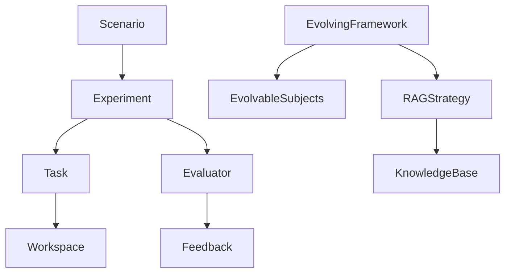
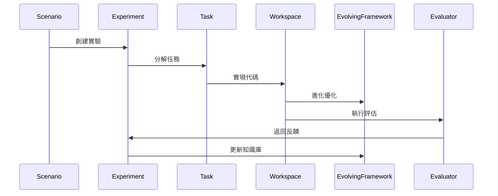
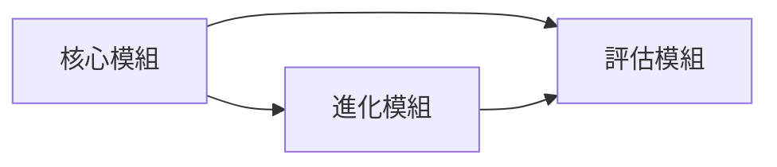
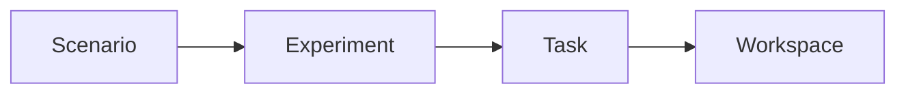
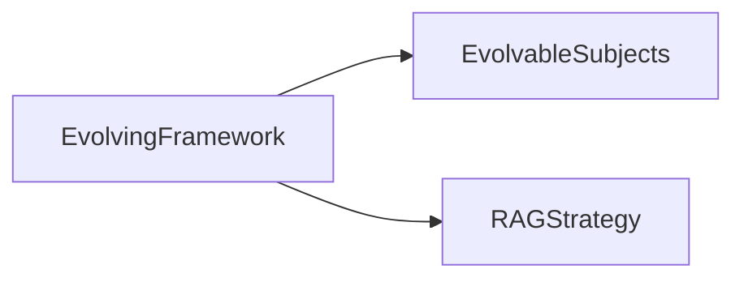
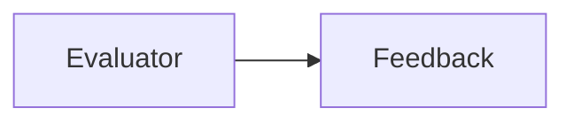
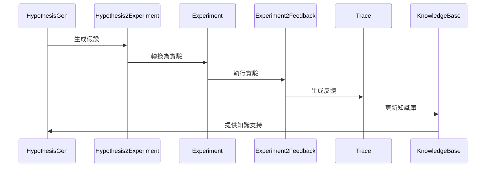
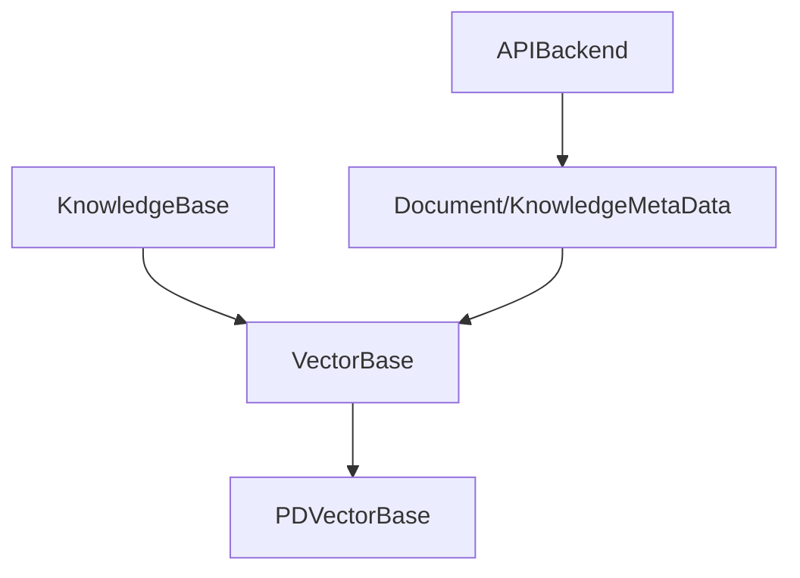
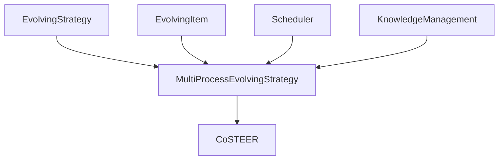
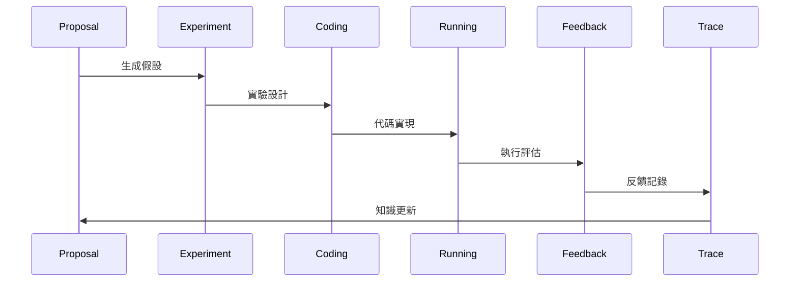

# RD-Agent 系統架構文檔

## 系統概述

RD-Agent 是一個自動化研究開發框架,專門用於數據挖掘和機器學習領域。該系統能夠自動提出假設、設計實驗、實現代碼並從實際執行結果中學習改進。

## 核心架構

## 主要模組說明

### 1. 核心模組 (Core)
- **Scenario**: 定義研究場景和背景信息
- **Experiment**: 管理實驗流程和任務序列
- **Task**: 具體實驗任務的抽象
- **Workspace**: 任務實現的工作空間
- **EvolvingFramework**: 進化框架,負責代碼和模型的迭代優化

### 2. 知識管理模組
- **KnowledgeBase**: 知識庫基礎設施
- **RAGStrategy**: 檢索增強生成策略
- **EvolvableSubjects**: 可進化對象

### 3. 評估模組
- **Evaluator**: 評估器接口
- **Feedback**: 評估反饋

## 模組交互時序圖

## 文件結構

主要目錄結構:
- `rdagent/core/`: 核心框架實現
- `rdagent/components/`: 可重用組件
- `rdagent/scenarios/`: 具體場景實現
- `rdagent/utils/`: 工具函數
- `rdagent/app/`: 應用實例

## 內部模組關係圖

### 頂層模組關係

### 核心模組結構

### 進化模組結構

### 評估模組結構

## 擴展性設計

系統通過抽象基類和接口實現高度可擴展性:
- `Scenario`: 可擴展支持新的研究場景
- `Evaluator`: 可實現不同的評估策略
- `RAGStrategy`: 可實現不同的知識檢索和生成策略
- `EvolvableSubjects`: 可定義新的可進化對象類型

## 工作流程

1. 通過 `Scenario` 定義研究場景
2. `Experiment` 創建並管理實驗流程
3. 將實驗分解為具體 `Task`
4. 在 `Workspace` 中實現任務
5. 使用 `EvolvingFramework` 優化實現
6. 通過 `Evaluator` 評估結果
7. 基於反饋進行迭代改進

## 假設生成與實驗反饋流程

### 假設與實驗組件

1. **假設生成 (HypothesisGen)**
   - 基於場景描述生成研究假設
   - 包含假設內容、理由和觀察結果
   - 利用知識庫支持假設生成

2. **假設轉換器 (Hypothesis2Experiment)**
   - 將抽象假設轉換為具體實驗
   - 設計實驗步驟和評估方法
   - 生成實驗代碼框架

3. **實驗反饋 (ExperimentFeedback)**
   - 包含決策結果和原因
   - 記錄觀察結果
   - 提供假設評估
   - 生成新的改進假設

4. **追蹤系統 (Trace)**
   - 維護實驗歷史記錄
   - 存儲假設和實驗結果
   - 支持最優假設查詢
   - 與知識庫交互

### 知識管理流程

1. 初始知識獲取
   - 從場景描述中提取領域知識
   - 加載預定義的知識庫

2. 知識累積
   - 記錄實驗結果和觀察
   - 更新假設評估結果
   - 存儲成功的實驗方案

3. 知識應用
   - 支持新假設生成
   - 指導實驗設計
   - 優化評估策略

## 向量化知識庫實現

### 知識表示

1. **文檔結構 (Document/KnowledgeMetaData)**
   - 內容 (content): 原始文本信息
   - 標籤 (label): 文檔分類標識
   - 向量 (embedding): 文本的向量表示
   - 分塊 (trunks): 長文本的分段存儲
   - 唯一標識 (id): UUID生成的文檔標識

2. **向量化存儲 (PDVectorBase)**
   - 基於Pandas DataFrame實現
   - 支持批量文檔添加
   - 維護向量索引結構
   - 提供相似度檢索功能

### 知識檢索流程

1. **文檔向量化**
   - 使用OpenAI API生成文本嵌入
   - 支持長文本分塊嵌入
   - 自動處理批量向量生成

2. **相似度搜索**
   - 基於餘弦相似度計算
   - 支持TopK檢索
   - 可設置相似度閾值
   - 返回相似文檔及分數

3. **知識持久化**
   - 支持向量庫的序列化存儲
   - 提供數據加載和導出功能
   - 維護知識庫更新狀態

## 代碼進化策略 (CoSTEER)

### 進化框架設計

1. **進化項目 (EvolvingItem)**
   - 包含子任務列表
   - 維護工作空間狀態
   - 追蹤進化歷史

2. **多進程進化策略**
   - 並行任務實現
   - 動態任務選擇
   - 代碼分配管理

### 進化流程

1. **任務篩選**
   - 識別未完成任務
   - 應用選擇閾值
   - 優先級排序

2. **並行實現**
   - 多進程代碼生成
   - 工作空間管理
   - 結果同步處理

3. **代碼整合**
   - 合併生成代碼
   - 更新工作空間
   - 維護進化狀態

### 調度機制

1. **任務選擇**
   - 基於閾值控制
   - 支持隨機選擇
   - 可擴展調度策略

2. **資源管理**
   - 進程池配置
   - 並行度控制
   - 任務分配優化

## 研發循環工作流 (RD Loop)

### 工作流組件

1. **假設生成器 (HypothesisGen)**
   - 基於場景生成研究假設
   - 利用歷史記錄優化假設
   - 整合知識庫信息

2. **實驗轉換器 (Hypothesis2Experiment)**
   - 將假設轉換為具體實驗
   - 定義實驗任務序列
   - 設置評估標準

3. **開發者 (Developer)**
   - 代碼實現
   - 實驗執行
   - 結果收集

4. **評估器 (Experiment2Feedback)**
   - 結果分析
   - 生成反饋
   - 更新追蹤記錄

### 循環控制

1. **會話管理**
   - 維護工作流狀態
   - 異常處理機制
   - 日誌記錄

2. **流程步驟**
   - 提出假設 (_propose)
   - 生成實驗 (_exp_gen)
   - 代碼實現 (coding)
   - 執行評估 (running)
   - 反饋總結 (feedback)

3. **追蹤系統**
   - 記錄實驗歷史
   - 維護知識庫
   - 支持迭代優化